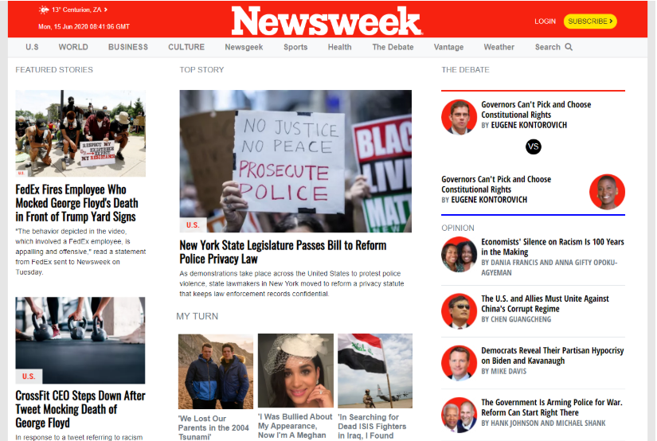

# Responsive-Web-Design-_The-NewsWeek
This project is a replica of the [NewsWeek](https://www.newsweek.com/) website. It is a part of the microverse curriculum mainly focusing on mobile first responsive design.

## Project Design:

* large/desktop screen view

 

This project was designed using bootstrap 4 classes for component layouts. I also implemented the bootstrap 4 grid system to responsively position content on the page on all screen sizes. Sass CSS acted as an alternative way to add more style on the elements & beauty on the site.

Please take note, this project has no functionality to it. It was designed as a means of strengthening mobile first design skills. And also, it is a microverse.inc mandatory project.

## Built With

- CSS, HTML, JavaScript
- Sass, Bootstrap 4
- Stylelint validator

## Tools Used:

- Visual Studio Code

## Live Demo

[Live Demo Link](https://raw.githack.com/ClaytonSiby/Responsive-Web-Design-_The-NewsWeek/NewsWeek-Homepage/idesign/index.html)

## Author

👤 **Clayton Siby**

- Github: [@Clayton Siby](https://github.com/ClaytonSiby)
- Twitter: [@ClaytonSiby](https://twitter.com/ClaytonSiby)
- Linkedin: [linkedin](https://www.linkedin.com/in/clayton-siby-48a8a0183/)
- claytonsiby@gmail.com

# 🤝 Contributing

Contributions, issues and feature requests are welcome!

Feel free to check the [issues page](https://github.com/ClaytonSiby/Responsive-Web-Design-_The-NewsWeek/issues).

## Show your support

Give a ⭐️ if you like this project!

## Acknowledgments

- Hat tip to The NewsWeek Site
- Odin Project
- StackOverflow
- W3Schools.com
- getbootstrap.com

# 📝 License

This project is [MIT](github.com/ClaytonSiby) licensed.